# backend-concurrency-learning


# 一、线程安全性

定义：当多个线程访问某个类时，不管运行时环境采用何种调度方式或者这些进程将如何交替执行，并且在主调代码中不需要任何额外的同步或协同，这个类都能表现出正确的行为，那么就称这个类是线程安全的。

- 原子性：提供了互斥访问，同一个时刻只能有一个线程来对它进行操作；
- 可见性：一个线程对主内存的修改可以及时的被其他线程观察到；
- 有序性：一个线程观察其他线程中的指令执行顺序，由于指令重排序的存在，该观察结果一般杂乱无序。

## 1.1、原子性

提供了互斥访问，同一个时刻只能有一个线程来对它进行操作。

- Atomic包
  - AtomicXXX：CAS、Unsafe.compareAndSwapInt【CAS】
  - AtomicLong、LongAdder【CAS】
  - AtomicReference、AtomicReferenceFieldUpdater【CAS】
  - AtomicStampedReference：可以解决CAS的ABA问题

- CAS算法
- synchronized：依赖JVM
  - 修饰代码块：大括号括起来的代码，作用于调用的对象。
  - 修饰方法：整个方法，作用于调用的对象。
  - 修饰静态方法：整个静态方法，作用于所有对象。
  - 修饰类：括号括起来的部分，作用于所有对象。
- Lock：依赖特殊的CPU指令，代码实现，ReentrantLock。


原子性对比：

| 锁类型       | 特性                                                 |
| ------------ | ---------------------------------------------------- |
| Atomic       | 竞争激烈时能维持常态，比Lock性能好；只能同步一个值。 |
| synchronized | 不可中断锁，适合竞争不激烈，可读性好。               |
| Lock         | 可中断锁，多样化同步，竞争激烈时能维持常态性能。     |


## 1.2、可见性

一个线程对主内存的修改可以及时的被其他线程观察到。

- synchronized
  - JMM关于synchronized的两条规定：
    - 线程解锁前，必须把共享变量的最新值刷新到主内存。
    - 线程加锁时，要清空工作内存中共享变量的值，从而使用共享变量时需要从主内存中重新读取最新的值（注意：加锁与解锁是同一把锁）。
- volatile
  - 通过加入内存屏障和禁止重排序优化来实现。
    - 对volatile变量写操作时，会在写操作后加入一条store屏障指令，将本地内存中的共享变量值刷新到主内存。
    - 对volatile变量读操作时，会在读操作前加入一条load屏障指令，从主内存中读取共享变量。

https://blog.csdn.net/chenzengnian123/article/details/122405842

导致共享变量在线程间不可见的原因。

- 线程交叉执行
- 重排序结合线程的交叉执行
- 共享变量更新后值没有在工作内存与主内存间及时更新。


## 1.3、有序性

一个线程观察其他线程中的指令执行顺序，由于指令重排序的存在，该观察结果一般杂乱无序。

Java内存模型中，允许编译器和处理器对指令进行重排序，但是重排序过程不会影响到单线程程序的执行，却会影响到多线程并发执行的正确性。

### 保证有序性：

- volatile
- synchronized
- Lock

### happens-before原则：

 如果两个操作的执行次序，无法从happens-before原则推导出来，那么就无法保证有序性，虚拟机可以随意重排序。

- 程序次序规则：一个线程内，按照代码顺序，书写在前面的操作先行发生于书写在后面的操作
- 锁定规则：一个unLock操作先行发生于后面对同一个锁的lock操作
- volatile变量规则：对一个变量的写操作先行发生于后面对这个变量的读操作
- 传递规则：如果操作A先行发生于操作B，而操作B又先行发生于操作C，则可以得出操作A先行发生于操作C
- 线程启动规则：Thread对象的start()方法先行发生于此线程的每一个动作
- 线程中断规则：对线程interrupt()方法的调用先行发生于被中断线程的代码检测到中断事件的发生
- 线程终结规则：线程中所有的操作都先行发生于线程的终止检测，我们可以通过Thread.join()方法结束、Thread.isAlive()的返回值手段检测到线程已经终止执行
- 对象终结规则：一个对象的初始化完成先行发生于他的finalize()方法的开始


# 二、安全发布对象

## 2.1、发布与逸出

- 发布对象：使一个对象能够被当前范围之外的代码所使用
- 对象逸出：一种错误的发布。当一个对象还没有构造完成时，就使它被其他线程所见

## 2.2、安全发布的四种方法

- 在静态初始化函数中初始化一个对象引用
- 将对象的引用保存到volatile类型域或者AtomicReference对象中
- 将对象的引用保存到某个正确构造对象的final类型域中
- 将对象的引用保存到一个由锁保护的域中


# 三、线程安全策略

## 3.1、不可变对象

- 不可变对象需要满足的条件
  - 对象创建以后其状态就不能修改
  - 对象所有域都是final类型
  - 对象是正确创建的（在对象创建其间，this引用没有逸出）
- final关键字：类、方法、变量
  - 修饰类：不能被继承
    - String、Integer、Long
    - final类中的成员变量可以根据需要设置为final
    - final类中的成员方法，都会被隐式的设置为final
  - 修饰方法：
    - 锁定方法不被继承类修改
    - 效率（早期版本的final方法，会内嵌调用提升效率，但如果方法过于复杂，会大打折扣）
    - private方法会隐式的被指定为final的方法
  - 修饰变量：
    - final修饰的基本类型数据变量，初始化后不能修改
    - final修饰的引用类型的数据变量，初始化后不能指向另外的对象
- Collections.unmodifiableXXX : Collection、List、Set、Map...
- Guava :：ImmutableXXX：Collection、List、Set、Map...


## 3.2、线程封闭

- Ad-hoc 线程封闭：程序控制实现，最糟糕，忽略
- 堆栈封闭：局部变量，无并发问题
- ThreadLocal线程封闭：特别好的封闭方法


## 3.3、线程不安全类与写法

- StringBuilder非线程安全，StringBuffer线程安全
- SimpleDateFormat非线程安全，JodaTime线程安全
- ArrayList，HashSet，HashMap等Collections非线程安全
- 先检查在执行：if(condition(a)) {handle(a);}非线程安全
  - 即时condition(a)和handle(a)都是线程安全，但联合起来也不再是原子性的，无法保证线程安全。


## 3.4、同步容器

- ArrayList -> Vector,Stack
- HashMap -> HashTable(key,value不能为null)
- Collections.synchronizedXXX(List,Set,Map）


## 3.5、并发容器J.U.C

- ArrayList -> CopyOnWriteArrayList【ReentrantLock==>CAS】
  - 读在原数组，无需加锁
  - 写在复制出的副本，需要加锁，避免复制出多个副本
- HashSet,TreeSet -> CopyOnWriteArraySet【ReentrantLock==>CAS】,ConcurrentSkipListSet【CAS】
  - ConcurrentSkipListSet不允许null，因为如果一个线程从map获取某个key，由于可以不存在会返回null，之后通过contains判断key，期望返回false；如果此时并发线程写入了一条value=null的值，那么contains的结果就是true。这样就会与真实情况不太一致了，这就是产生了二义性；为了避免二义性，不允许null。
  - ConcurrentSkipListSet针对addAll和containsAll以及removeAll，不是线程安全的，需要自己加锁。
- HashMap,TreeMap -> ConcurrentHashMap【ReentrantLock+CAS】,ConcurrentSkipListMap【CAS】
  - ConcurrentSkipListMap不允许null
  - ConcurrentHashMap不允许null
  - ConcurrentSkipListMap的key有序，适合高并发


安全共享对象的策略：

- 线程限制：一个被线程限制的对象，由线程独占，并且只能被占有它的线程修改
- 共享只读：一个共享只读的对象，在没有额外同步的情况下，可以被多个线程并发访问，但是任何线程都不能修改它
- 线程安全对象：一个线程安全的对象或者容器，在内部通过同步机制来保证线程安全，所以其他线程无需额外的同步就可以通过公共接口随意访问
- 被守护对象：一个被守护对象只能通过获取特定的锁来访问


# 四、J.U.C之AQS(AbstractQueuedSynchronizer)介绍

- 使用Node实现FIFO队列（双向链表），可以用于构建锁或者其他同步装置的基础框架
- 利用了一个int类型表示状态
- 使用的方法是继承
- 子类通过继承并通过实现它的方法管理器状态（acquire和release）的方法操纵状态
- 可以同时实现排它锁和共享锁的模式（独占、共享）

## 4.1、AQS同步组件

- CountDownLatch
  - 一次性使用，无法重置。
  - 一个或多个线程等待其他线程。
- Semaphore
- CyclicBarrier
  - 循环屏障，通过 reset() 重置后可多次使用。
- ReentrantLock
- Condition
- FutureTask


## 4.2、ReentrantLock与锁

- ReentrantLock(可重入锁)和synchronized区别

  - 可重入性
    - 对于一个线程两者都可以重入
  - 锁的实现
    - ReentrantLock是JDK实现的
    - synchronized是JVM实现的
  - 性能的区别
    - ReentrantLock
    - synchronized之前很慢，后来就好了(因为引入了偏向锁、自旋锁)

  - 功能区别

    - ReentrantLock使用灵活

    - synchronized使用简单

  - ReentrantLock独有的功能
    - 可指定是公平锁还是非公平锁（默认非公平锁），而synchronized只有非公平的锁
    - 提供了一个Condition类，可以分组唤醒需要唤醒的线程
    - 提供了能够中断等待锁的线程的机制，lock.lockInterruptibly()

当只有少量竞争者时，synchronized比较合适；

竞争者不少，但增长趋势能预估，可以用ReentrantLock；

## 4.3、J.U.C之FutureTask

- Callable与Runnable接口对比
  - 两者都只有一个方法
  - Callable是泛型接口，接口方法有返回值，且可以抛出异常！
- Future接口
  - 可以得到别的线程任务方法的返回值

- FutureTask类

  - 实现了 `RunnableFuture<V>` 接口，该接口集成于 `Runnable,Future<V>` 接口。

    ```java
    public interface RunnableFuture<V> extends Runnable, Future<V> {
        /**
         * Sets this Future to the result of its computation
         * unless it has been cancelled.
         */
        void run();
    }
    ```

  


## 4.4、Fork/Join框架

采用工作窃取算法，是指某个线程从其他队列里窃取任务执行。

## 4.5、BlockingQueue

| -       | Throws Exception | Special Value | Blocks | Times Out                   |
| ------- | ---------------- | ------------- | ------ | --------------------------- |
| Insert  | add(o)           | offer(o)      | put(o) | offer(o, timeout, timeuint) |
| Remove  | remove(o)        | poll()        | take() | poll(timeout, timeunit)     |
| Examine | element()        | peek()        |        |                             |

- ArrayBlockingQueue
  - FIFO
- DelayQueue
  - 延迟队列
- LinkedBlockingQueue
  - FIFO
- PriorityBlockingQueue
  - 带有优先级的队列
- SynchronousQueue
  - 无界非缓存的同步队列

# 五、线程池

- new Thread弊端
  - 每次new Thread新建对象，性能差
  - 线程缺乏统一管理，可能无限制的新建线程，相互竞争，有可能占用过多系统资源导致死机或OOM
  - 缺少更多功能，如更多执行、定期执行、线程中断
- 线程池的好处
  - 重用存在的线程，减少对象创建、消亡的开销，性能佳
  - 可有效控制最大并发线程的数量，提高系统资源利用率，同时可避免过多资源竞争，避免阻塞
  - 提供定时执行、定期执行、单线程、并发数控制等功能

## 5.1、ThreadPoolExecutor

- corePoolSize:核心线程数量
- maximumPoolSize:线程最大线程数
- keepAliveTime:线程没有任务执行时最多保持多久时间终止
- unit:keepAliveTime的时间单位
- workQueue:阻塞队列，存储等待执行的任务，很重要，会对线程池运行过程产生重大影响
- threadFactory:线程工厂，用来创建线程
- rejectHandler:当拒绝处理任务时的策略
  - AbortPolicy：抛异常（默认）
  - CallerRunsPolicy：用调用者所在的线程来执行任务
  - DiscardOldestPolicy：丢弃队列中最靠前的任务，来执行当前任务
  - DiscardPolicy：直接丢弃当前的任务

## 5.2、ThreadPoolExecutor状态

- RUNNING
- SHUTDOWN
- STOP
- TIDYING
- TERMINATED

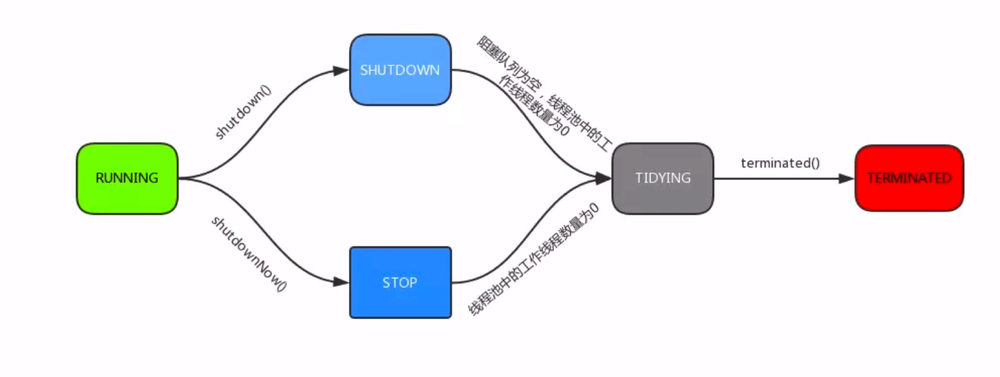

## 5.3、ThreadPoolExecutor任务

- execute():提交任务，交给线程池执行
- submit():提交任务，能够返回执行结果 execute + Future
- shutdown():关闭线程池，等待任务都执行完
- shutdownNow():关闭线程池，不等待任务执行完
- getTaskCount():线程池已经执行和未执行的任务总数
- getCompletedTaskCount():已完成的任务数量
- getPoolSize():线程池当前的线程数量
- getActiveCount():当前线程池中正在执行任务的线程数量

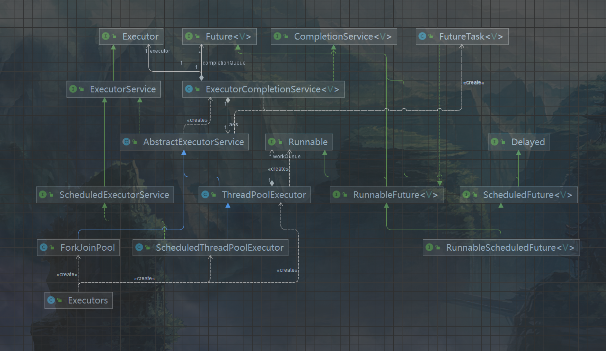

## 5.4、Executor框架接口

- Executors.newCachedThreadPool
- Executors.newFixedThreadPool
- Executors.newScheduledThreadPool
- Executors.newSingleThreadExecutor

## 5.5、合理配置

- CPU密集型任务，就需要尽量压榨CPU，参考值可以设为NCPU+1
- IO密集型任务，参考值可以设为2*NCPU


# 六、多线程并发拓展

## 6.1、死锁

- 死锁发生的必要条件
  - 互斥条件
    - 排他性的使用锁。
  - 请求和保持条件
    - 已经保持了一个资源，再请求其他资源，而该资源已经被其他线程占用。
    - 简称，吃着碗里瞧着锅里。
  - 不剥夺条件
    - 线程已经获得的条件，在未使用完之前，无法被剥夺。
  - 环路等待条件
    - 存在线程请求资源，形成环形链！

~

## 6.2、多线程并发最佳实践

- 使用本地变量
- 使用不可变类
- 最小化锁的作用域范围：S=1/(1-a+a/n) 【阿姆达尔定律】
  - a - 并行计算部分的比例
  - n - 并行处理的节点个数
  - S - 加速比
  - 当a=1时，S=n，只有并行，没有串行。
  - 当a=0时，S=1，只有串行，没有并行。
  - 当n取向无穷大时，S趋近1/1-a，是加速比的上限。
    - 比如串行部分占0.25，那么a=0.75，所以S不会超过4的并行度。


- 使用线程池的Executor，而不是直接new Thread执行
  - 创建一个线程是昂贵的。
- 宁可使用同步也不要使用线程的wait和notify方法
  - 尽量使用同步工具
    - CountDownLatch
    - Semaphore
    - CyclicBarrier
- 使用BlockingQueue实现生产-消费模式
- 使用并发集合而不是加了锁的同步集合
  - ConcurrentHashMap
  - ConcurrentSkipListMap
  - CopyOnWriteArrayList
  - CopyOnWriteArraySet
  - BlockingQueue
  - DelayQueue
- 使用Semaphore创建有界的访问
- 宁可使用同步代码块，也不使用同步的方法
- 避免使用静态变量

## 6.3、Spring与线程安全

- Spring bean：Singleton、Prototype
- 无状态对象
  - 自身没有状态，也不会被多线程修改状态，产生线程安全问题。


## 6.4、HashMap与Concurrent HashMap

### HashMap单线程扩容

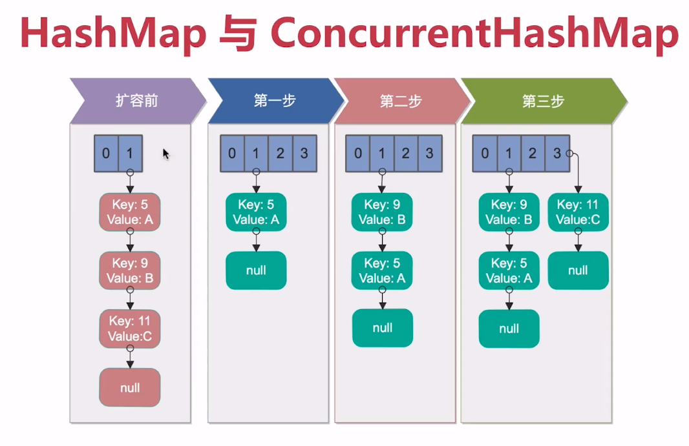

### HashMap多线程扩容

线程1准备扩容，已经把5挂到index=1了，准备操作9时时间片用完了。线程2扩容并把5、9、11全部挂载完毕！

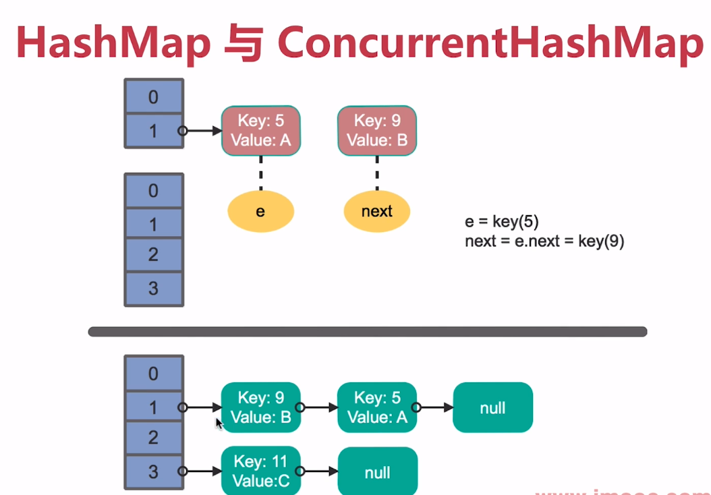


时间片留给线程1了，线程1把5挂载到index=1，再把9插入index=1的头部；由于线程2已经在9后面挂载了5，导致9指向5,5指向9，就死循环了。

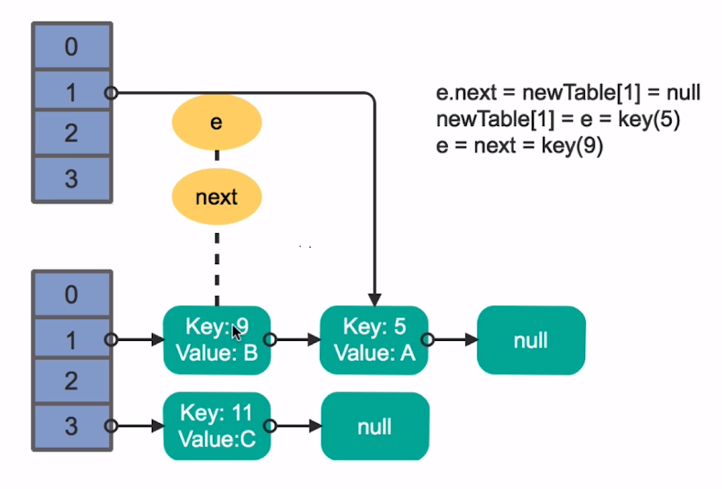

### ConcurrentHashMap

Java7：

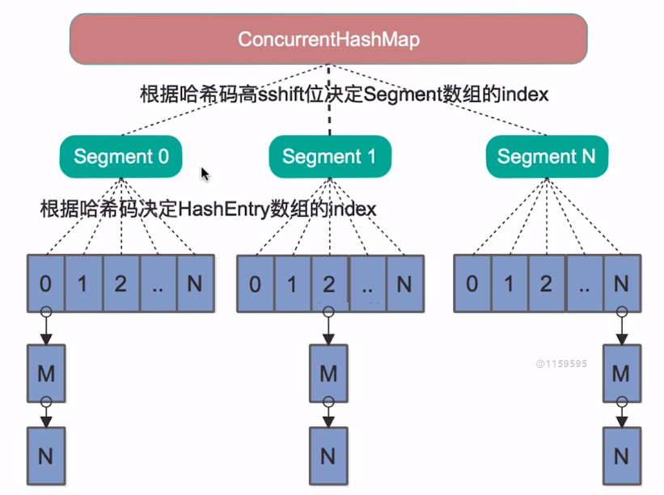

Java8：

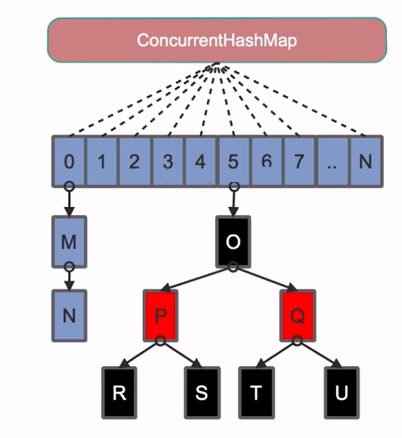

## 6.5、多线程并发与线程安全总结

- 线程安全性
  - 原子性
  - 可见性
  - 有序性
  - atomic包
  - CAS算法
  - synchronized与Lock
  - volatile
  - happens-before
- 安全发布对象
  - 安全发布方法
  - 不可变对象
  - final关键字使用
  - 不可变方法
  - 线程不安全类与写法
- 线程封闭同步容器并发容器
  - 堆栈封闭
  - ThreadLocal线程封闭
  - JDBC的线程封闭
  - 同步容器
  - 并发容器
  - J.U.C
- AQS等J.U.C组件
  - CauntDownLatch
  - Semaphore
  - CyclicBarries
  - ReentrantLock与锁
  - Condition
  - FutureTask
  - Fork/Join框架
  - BlockingQueue
- 线程调度
  - new Thread弊端
  - 线程池的好处
  - ThreadPoolExecutor
  - Executor框架接口
- 线程安全补充内容
  - 死锁的产生于预防
  - 多线程并发最佳实践
  - Spring的线程安全
  - HashMap与ConcurrentHashMap深入讲解


# 七、扩容思路讲解

- 垂直扩容（纵向扩展）：提高系统部件能力
- 水平扩容（横向扩展）：增加更多系统成员来实现

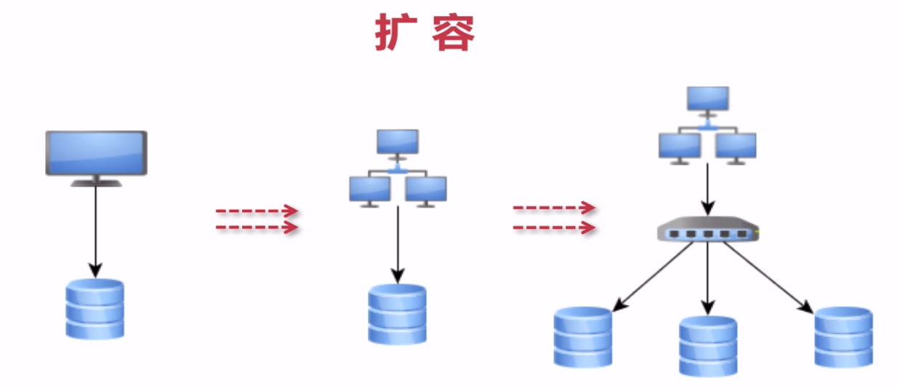

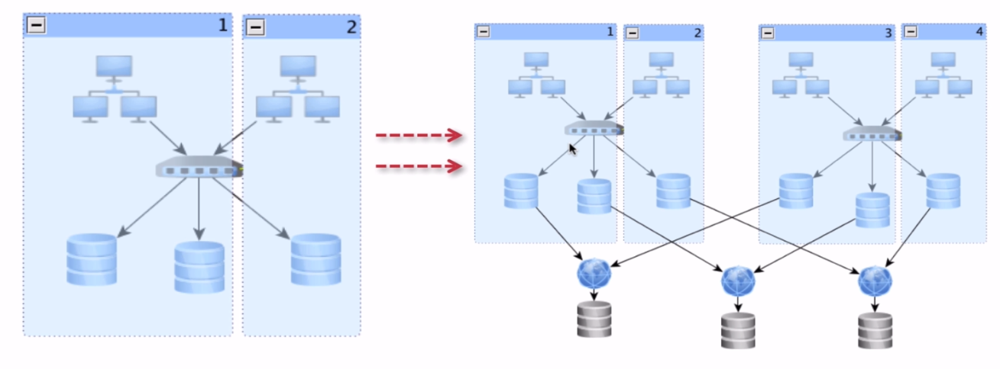

# 八、其他

## 8.1、缓存

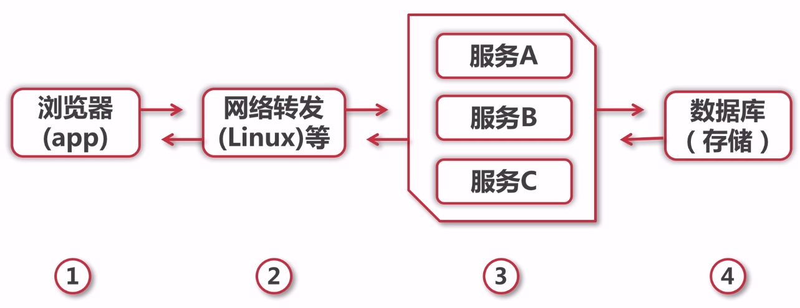


## 8.2、缓存特征

- 命中率：命中数/（命中数+没有命中数）
- 最大元素（空间）
- 清空策略：FIFO、LFU（最少使用策略）、LRU（最近最少使用策略）、过期时间、随机等


## 8.3、缓存命中率影响因素

- 业务场景和业务需求
  - 读多写少
- 缓存的设计（粒度和策略）
- 缓存容量和基础设施


## 8.4、缓存分类和应用场景

- 本地缓存：编程实现（成员变量、局部变量、静态变量）、Guava Cache
- 分布式缓存：Memcache、Redis


## 8.5、高并发场景下缓存常见问题

- 缓存一致性
  - 更新数据库成功-->更新缓存失败-->数据不一致
  - 更新缓存成功-->更新数据库失败-->数据不一致
  - 更新数据库成功-->淘汰缓存失败-->数据不一致
  - 淘汰缓存成功-->更新数据库失败-->数据不一致

- 缓存并发问题
  - 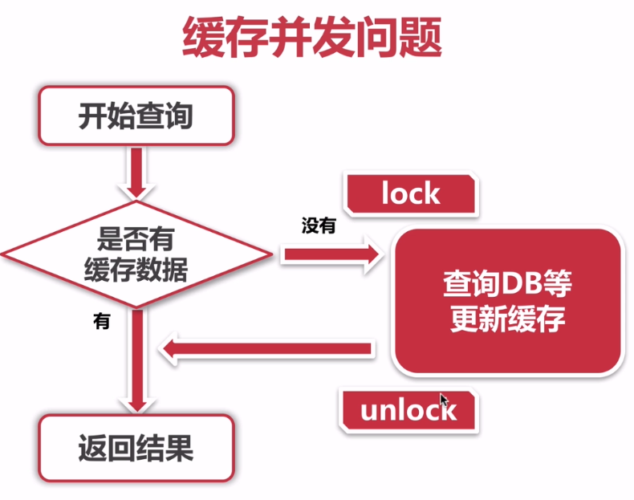
- 缓存穿透问题：缓存key不存在，被大量攻击访问
  - 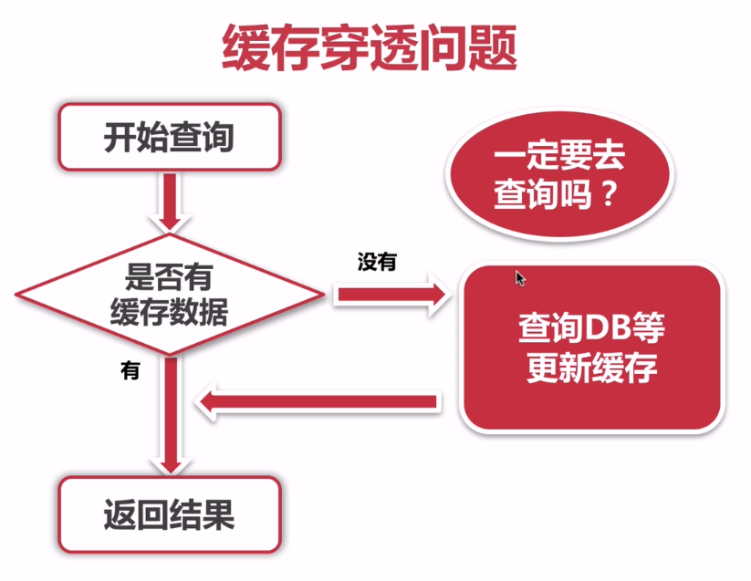
  - 对空数据进行缓存：实现成本低，适合命中不高但可能被频繁更新的数据
  - 增加布隆过滤器
- 缓存雪崩问题：缓存集中失效
- 缓存击穿问题：缓存命中很高，但某一刻失效了


## 8.6、高并发下消息队列

消息队列特性：

- 业务无关：只做消息分发
- FIFO：先投递先到达
- 容灾：节点的动态增删和消息的持久化


为什么需要消息队列：

- 【生产】和【消费】的速度或稳定性等因素不一致


消息队列的好处：

- 业务解耦
- 最终一致性
- 广播
- 错峰与流控


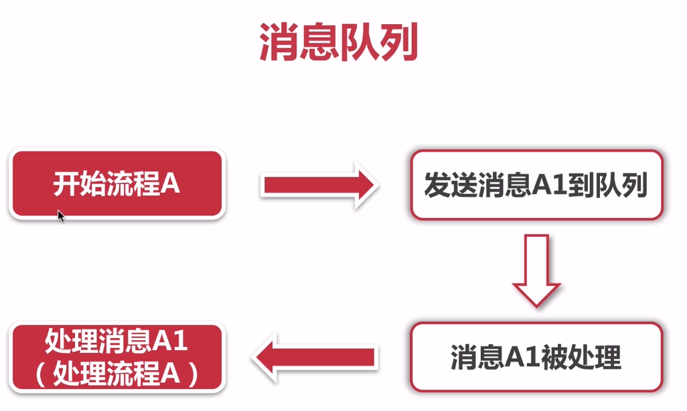


## 8.7、应用拆分

应用拆分原则：

- 业务优先
- 循序渐进
- 兼顾技术：重构、分层
- 可靠测试

应用拆分思考：

- 应用之间通信：RPC（dubbo等）、消息队列
- 应用之间数据库设计：每个应用都有独立的数据库
- 避免事务操作跨应用


## 8.8、应用限流

应用限流算法：

- 计数器法
- 滑动窗口
- 漏桶算法
- 令牌桶算法

应用限流实现：

- Guava RateLimiter
- 分布式限流实现
  - Redis：incrby key num


## 8.9、服务降级与服务熔断

## 8.10、数据库切库、分库、分表

- 数据库瓶颈
  - 单个库数据量太大（1T-2T）：多个库
  - 单个数据库服务器压力过大、读写瓶颈：多个库
  - 单个表数据量过大：分表

- 数据库切库
  - 切库的基础及实际应用：读写分离
  - 自定义注解完成数据库切库 - 代码实现

- 数据库支持多个数据源与分库


